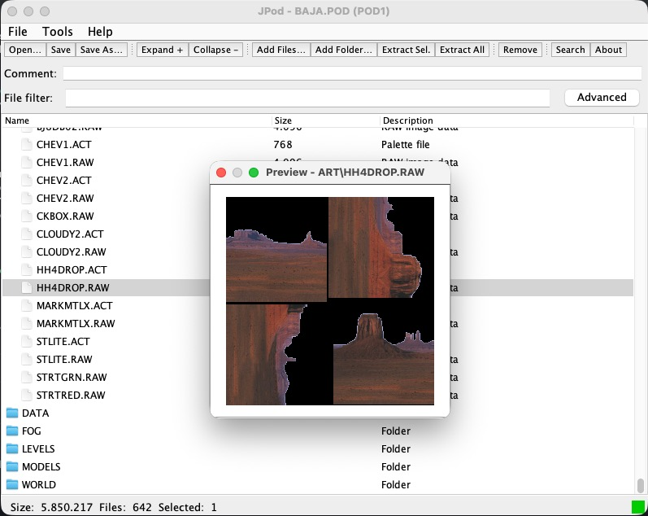

# JPod

[](#requirements)
[](#building-from-source)
[](#requirements)
[](LICENSE)

**Terminal Reality POD archive utility.**

JPod opens, browses, previews, extracts and builds the `POD` archives used by
*Monster Truck Madness 1 & 2*, *CART Precision Racing*, *Hellbender*, *Terminal
Velocity*, *Fury3* and their relatives. It reads and writes both the classic POD1
directory and the Community Patch 3 **POD1-64** extension with 64-byte entry
names. It also reads and explicitly authors `POD2`; `EPD` remains read-only.

Written in Java 17 with Swing, so it runs on Windows, macOS and Linux with no
dependencies beyond the JDK. [KPod](https://github.com/juanputrerasm/KPod) is the
Windows-native C# port and matches it byte for byte: the same archives, the same
`.inf` and `.lst` reports, the same format names.



*Browsing `BAJA.POD` with `ART\HH4DROP.RAW` previewed against the palette stored
in its own directory field.*

---

## Supported formats

| Format | Games | Support |
|---|---|---|
| `POD1` | MTM 1 & 2, CPR, Hellbender, Terminal Velocity, Fury3 | browse, preview, extract, save |
| `POD1-64` (Extended POD1) | Community Patch 3 content | browse, preview, extract, save |
| `POD2` | Nocturne, 4x4 Evo 1 & 2 | browse, preview, extract, explicit save/conversion, CRC, timestamp and audit history |
| `EPD` | Fly! | browse, preview, extract |

There is no POD3+ support and no MOD playback. Terminal
Reality's `.mod` files are 6-channel ProTracker and need a tracker player, so
extract them and open them in VLC or OpenMPT.

---

## Features

### Archive viewing
- Open `.pod` and `.epd` archives and browse them in a file-viewer style table
  with Name / Size / Description columns.
- Folders and subfolders are shown with icons and start collapsed, so root files
  and top-level folders are easier to scan.
- Click a column header to sort by name, size or description; click again to
  reverse it, and a third time to return to archive order.
- Filter visible entries instantly with the quick search field, or open the
  Advanced search dialog for targeted searches and jump-to selection.
- The archive comment (the 80-character POD header field) sits in an editable
  field below the toolbar.
- The ten most recently opened files are kept in a per-user JSON config in the
  operating system's preferences location.

### Extraction
- **Extract All** writes every entry to a chosen folder, recreating the
  archive's subfolder structure.
- **Extract Selected** extracts the highlighted entries, with an option to
  preserve or flatten the folder structure.

### Building and editing
- **New Archive** starts an empty archive from scratch.
- **Open Response List File** loads the existing `.lst` syntax or a
  PODTool-compatible `.rsp` with `podFilename:`, `volumeName:`, `//` comments
  and relative source paths.
- **Add Files / Add Folder** appends files or recursively imports a directory,
  via a picker or drag and drop.
- **Folder editing** creates virtual folders, renames files or folder trees, and
  moves selections by command or internal drag and drop. Archive paths use
  backslashes and keep their case and entry order.
- **Remove** drops selected entries from the in-memory list.
- **Replace** (right-click) swaps a single entry's data with a file from disk,
  keeping the original archive name.
- **Validate Archive** checks limits, unsafe or duplicate paths, field capacity,
  payload ranges, embedded RAW palette records, checksums and the expected
  output layout.
- **Save / Save As** saves a named archive or writes a copy. The actual output
  format is confirmed before writing; POD1 is the default and POD2 must be
  chosen explicitly.

### Reports
- **Save .inf** exports a fixed-column text report: filename, total size, entry
  count, comment, and a padded name / size / offset table.
- **Save .lst** exports a plain entry-name list that the response list loader
  can read back.

### File preview
Double-click any entry, or choose Preview from the right-click menu, for a
type-aware preview:

| Extension | Preview |
|---|---|
| `.raw`, `.clr` | 8-bit paletted image decoded with the matched `.act` palette (see [Palette resolution](#palette-resolution)). Art textures (64x64) are shown at 4x zoom. Non-standard RAW sizes can be previewed by choosing width, height and palette manually. |
| `.act` | 16x16 colour swatch grid; hover shows the index and hex value. |
| `.wav` | PCM audio player with play, pause, stop and a position readout. |
| `.bmp`, `.png`, `.jpg`, ... | Standard images via `javax.imageio`. |
| `.txt`, `.def`, `.nav`, `.lvl`, `.sit`, `.lst`, `.ini`, `.cfg`, `.tex`, `.tnl`, `.ttx`, `.trk`, `.trn`, `.ndx`, `.mic` and other text formats | Scrollable monospaced text viewer. |
| Anything else | Hex dump of the first 4096 bytes. |

#### Palette resolution
For `.raw` and `.clr` files the palette is resolved in this order:

1. The palette recorded in the entry's own POD directory field
2. Same base name in the same archive directory, so `ART\DEMO1.RAW` takes
   `ART\DEMO1.ACT`
3. Any other `.act` file in the same directory
4. `VGA.ACT` anywhere in the archive
5. `METALCR2.ACT` anywhere in the archive, the MTM1 default palette
6. `metalcr2.act` bundled as a classpath resource
7. Greyscale fallback

Step 1 is the one that matters for MTM1, Terminal Velocity, Fury3 and Hellbender.
Their packer stored the palette each RAW was authored against in the spare bytes
of the entry's name field, and it is not derivable from the file name: on those
games' main archives the old step-2-onward guess picks the wrong palette for 8221
of 8224 RAW entries, because it takes whichever `.act` happens to come first in
the archive. MTM2, CPR and community archives carry no such record and fall
straight through to the name-based rules.
[`docs/POD_FORMAT.md`](docs/POD_FORMAT.md) specifies it in full.

When a RAW file does not match the common built-in sizes, JPod offers a dialog
where you can choose width and height manually, swap them instantly, or pick a
palette from the same-name ACT, any ACT inside the POD, `VGA.ACT`, `METALCR2.ACT`
or greyscale. Common non-square defaults are preselected: 64000 bytes gives
320x200, 256000 gives 640x400, and 307200 gives 640x480.

### Mount in pod.ini
Adds the open archive to the game's `pod.ini` mount list. JPod treats `99` as the
recommended limit, warns when the list is already larger, and still mounts the POD
rather than blocking the action. It searches the archive's folder and its parent,
and detects duplicates.

---

## POD1-64 (Extended POD1)

POD1-64 is the Community Patch 3 long-name extension. It is not a 64-bit archive
format and it is not EPD: the 64 refers only to the widened directory name field.

| Property | Classic POD1 | POD1-64 |
|---|---:|---:|
| Header | 84 bytes | 84 bytes |
| Directory name field | 32 bytes | 64 bytes |
| Longest name | 31 bytes | 63 bytes |
| Directory record | 40 bytes | 72 bytes |
| Directory entry `i` starts at | `84 + i * 40` | `84 + i * 72` |

POD1 has no magic value, so JPod detects the layout by validating it. The classic
40-byte directory is tried first and accepted only when every record decodes to a
plausible non-empty path whose byte range lies inside the file and does not begin
before the directory ends; the 72-byte layout is tried only if the classic table
fails. That ordering keeps ordinary archives from being reported as extended. The
title bar shows `Extended POD1` when the wider directory was used.

For a new archive, JPod emits classic POD1 whenever every complete directory field
fits, and promotes to POD1-64 only when a path or embedded RAW palette record needs
the wider field. An opened POD1-64 archive stays extended. The whole stored record
counts, including the path, terminators and palette name. Data that cannot fit 64
bytes is rejected rather than truncated.

---

## Requirements

| Requirement | Version |
|---|---|
| Java runtime | 17 or later |
| Build tool (source only) | Maven 3.8+ |

No runtime dependencies beyond the JDK standard library.

---

## Getting started

Prebuilt binaries are on the
[Releases](https://github.com/juanputrerasm/JPod/releases) page. Download
`jpod.jar` and run it:

```sh
java -jar jpod.jar
```

On most desktops you can also double-click the jar, or pass an archive path to
open it directly:

```sh
java -jar jpod.jar /path/to/GAME.POD
```

1. **Open...**, or pass a path on the command line.
2. Double-click a folder row to expand it, or use **Expand +** to open everything.
3. Double-click a file to preview it.
4. Select entries and press **Extract Sel.**, or **Extract All** for the lot.

---

## Usage

### Toolbar

| Control | Action |
|---|---|
| **Open...** | Open a POD or EPD archive |
| **Save** / **Save As...** | Save the named archive, or write the entry list to a new `.pod` |
| **Expand +** / **Collapse -** | Open or close every folder |
| **Add Files...** / **Add Folder...** | Append files, or import a directory recursively |
| **Extract Sel.** / **Extract All** | Extract the selection, or everything |
| **Remove** | Drop the selected entries from the list |
| **Search** | Open the search dialog |

### Menus

- **File**: Open POD, New Archive, Open Response List File, Open Recent, Add
  Files, Add Folder, Create Folder, Remove Selected, Save, Save As, Extract All,
  Extract Selected, Save .inf Report, Save .lst List, Exit
- **Tools**: Mount in pod.ini, Search, Validate Archive, Record POD2 audit
  history, Set Audit Author, View POD2 Audit History
- **Help**: About

### Status bar

`Size` is what the archive would occupy if saved now, which is why it changes as
entries are added and removed, and why it grows by 32 bytes per entry the moment a
name forces the POD1-64 directory. `Files` and `Selected` are counts, `unsaved`
appears once the list differs from what is on disk, and the square at the right
edge turns red while an operation is running.

---

## Building from source

Building needs a JDK 17 or later and Maven 3.8+.

```sh
mvn package          # builds target/jpod.jar
mvn test             # runs the format and manifest tests
java -jar target/jpod.jar
```

The test suite covers POD1 and POD1-64 detection, directory-field and palette
preservation, name-length boundaries, payload bounds, POD2 checksums and audit
records, and a set of stable SHA-256 authoring vectors shared with KPod that prove
both ports emit identical bytes.

### Project layout

```
src/main/java/com/mtm2/jpod/
├── JPodApp.java                   Entry point
├── PodSession.java                Shared mutable state for the current archive
├── AppConfig.java                 Per-user config and recent files
├── io/
│   ├── pod/
│   │   ├── PodArchive.java        Immutable in-memory archive model
│   │   ├── PodArchiveReader.java  Reads a .pod file into PodArchive
│   │   ├── PodArchiveWriter.java  Builds and writes a .pod file from blobs
│   │   └── PodArchiveValidator.java  Pre-save and post-open validation
│   ├── PodExtractService.java     Extracts entries to disk
│   ├── PodManifestParser.java     Parses .lst and .rsp response files
│   ├── PodReportExporter.java     Writes .inf and .lst reports
│   ├── PodIniMounter.java         Adds a POD to pod.ini
│   └── RawImageDecoder.java       Decodes .raw / .clr / .act image data
└── ui/
    ├── MainWindow.java            Main application window
    ├── PreviewWindow.java         Type-aware file preview
    ├── AudioPlayerDialog.java     WAV playback
    ├── BuildArchiveDialog.java    New-archive configuration
    ├── ExtractOptionsDialog.java  Extract destination and options
    ├── SearchDialog.java          Entry search
    └── AboutDialog.java

src/test/java/com/mtm2/jpod/io/
├── pod/PodArchiveFormatTest.java  Format detection, round trips, POD2, vectors
└── PodManifestParserTest.java     Response-file parsing
```

---

## Format specification

[`docs/POD_FORMAT.md`](docs/POD_FORMAT.md) specifies the whole POD family: classic
POD1, the POD1-64 long-name extension, POD2 and EPD. It covers the palette record
the early Terminal Reality packer stored in the spare bytes of each RAW entry's
name field, which is documented nowhere else, and it marks every claim as verified
against shipped archives, documented upstream, implemented but unconfirmed, or
unresolved. [`docs/pod-format.json`](docs/pod-format.json) carries the same
structures as machine-readable data.

## References

- [KPod](https://github.com/juanputrerasm/KPod) - the Windows-native C# port
- [Monster Truck Madness Guild](https://www.mtm2.com/%7Emtmg/index.shtml)
- [MTM2 Engine Content Limits](https://www.mtm2.com/~mtmg/misc/ENGINE_LIMITS.md)
  - extended-directory design and name budgets
- [EPD Format
  Reference](https://github.com/jopadan/termpod/wiki/EPD-Format-Reference)
- [Pod 2 Format
  Reference](https://github.com/jopadan/termpod/wiki/Pod-2-Format-Reference)

---

## Credits

Developed by **Juan Pablo Utreras** for the Monster Truck Madness Guild.

Based on the original WinPod by MDMRE.

Licensed under the [Apache License 2.0](LICENSE).

Monster Truck Madness, Terminal Velocity, Fury3, Hellbender, CPR, Nocturne and
4x4 Evo are trademarks of their respective owners. This is an unofficial,
community-made utility with no affiliation to Microsoft or Terminal Reality.